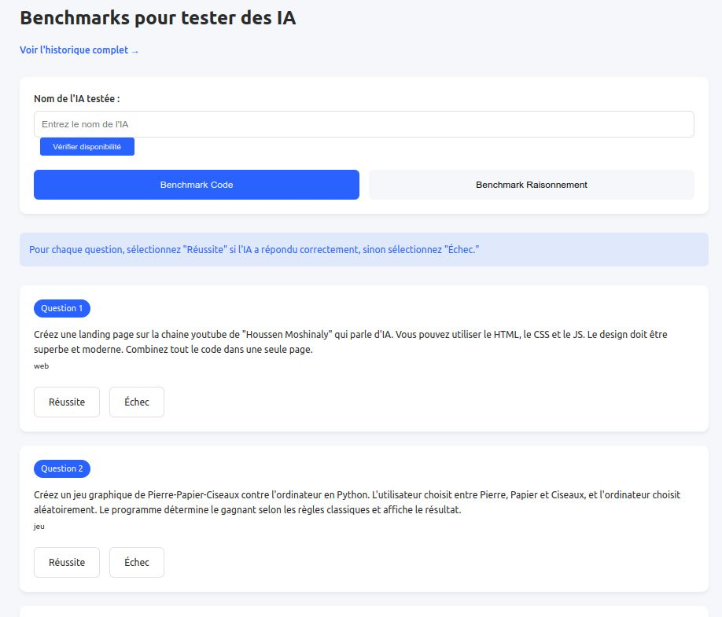

# BenchAI - Plateforme de Benchmarking d'IA



## Description
BenchAI est une plateforme complète pour évaluer et comparer les performances de différents modèles d'intelligence artificielle. Le projet permet de :

- Classer les modèles selon divers critères
- Visualiser les résultats via des graphiques
- Gérer l'historique des benchmarks
- Exporter les données

## Fonctionnalités Clés

### Classement
- Top 100 des meilleurs résultats
- Filtrage par type (Code, Raisonnement)
- Graphiques interactifs
- Système de badges

### Historique
- Filtres avancés
- Export CSV/PDF
- Pagination des résultats

### Gestion
- Enregistrement des nouveaux benchmarks
- Validation des entrées
- Interface intuitive

## Personnalisation des Questions

Les questions pour les modes Code et Raisonnement peuvent être facilement modifiées en éditant les fichiers JSON suivants :

- `backend/data/questions-ia-code.json` : Questions pour le mode Code
- `backend/data/questions-ia-raisonnement.json` : Questions pour le mode Raisonnement

Le format JSON simple permet même aux utilisateurs novices de modifier les questions :

```json
{
  "question": "Créez un jeu graphique de Pierre-Papier-Ciseaux contre l'ordinateur en Python. L'utilisateur choisit entre Pierre, Papier et Ciseaux, et l'ordinateur choisit aléatoirement. Le programme détermine le gagnant selon les règles classiques et affiche le résultat.",
        "type": "jeu",
        "categorie": "code"
    },
}
```

## Installation

1. Cloner le dépôt :
```bash
git clone https://github.com/votre-utilisateur/benchai.git
```

2. Installer les dépendances :
```bash
cd benchai/backend
npm install
```

3. Lancer l'application :
```bash
./lancement_benchai.sh
```

## Structure du Projet

```
benchai/
├── backend/          # Code serveur
│   ├── data/         # Données des benchmarks
│   ├── server.js     # Point d'entrée
├── frontend/         # Interface utilisateur
│   ├── index.html    # Page principale
│   ├── styles.css    # Feuilles de style
├── scripts/          # Scripts utilitaires
│   ├── lancement_benchai.sh
│   ├── sauvegarde_benchai.sh
```

## License
Ce projet est sous license MIT. Voir le fichier [LICENSE](LICENSE) pour plus de détails.
>>>>>>> f3ad184 (Commit initial)
